<div align="center">


<h1>Cloud-Native Firewall</h1>

<p><strong>The Strategic Control Plane for Unified Network Security, Policy Orchestration, and Zero-Trust Enforcement</strong></p>

[]()
[]()
[]()
[]()

<br/>

> **"Traditional perimeters are gone. In the cloud-native world, identity is the new perimeter, but the network remains the ultimate enforcement layer."** 
> Cloud-Native Firewall is an industrial-grade security orchestration platform designed to centralize the management of distributed firewalling across Azure, AWS, GCP, and Kubernetes.

</div>

---

## 🏛️ Executive Summary

The **Cloud-Native Firewall** is a premium, flagship security platform designed for CISOs, SOC leaders, and Network Security teams. As organizations adopt multi-cloud and microservices, the security perimeter has fragmented into thousands of disparate rules, endpoints, and policy formats.

This platform provides a **Unified Control Plane** for network security, abstracting the complexity of Azure Firewall, AWS Network Firewall, and Kubernetes Network Policies into a single, auditable governance model. It empowers organizations to implement **Zero-Trust Microsegmentation** at scale, ensuring that every packet is authorized, every drift is detected, and every policy is versioned.

---

## 💡 Why Cloud-Native Firewalls Matter

Legacy hardware-based firewalls cannot keep pace with the ephemeral nature of cloud resources.
- **Microservices Complexity**: Protecting east-west traffic between thousands of pods.
- **Multi-Cloud Fragmentation**: Managing security rules in three different provider portals.
- **Policy Drift**: The risk of "temporary" rules becoming permanent security holes.
- **Audit & Compliance**: The need for centralized evidence that the perimeter is actually secure.

---

## 🚀 Business Outcomes

### 🎯 Strategic Security Impact
- **100% Policy Consistency**: Unified rules applied across all cloud providers and clusters.
- **90% Reduction in Lateral Movement**: Granular microsegmentation preventing attackers from pivoting.
- **Automated Drift Remediation**: Real-time correction of unauthorized firewall changes.
- **Zero-Touch Compliance**: Automated generation of SOC2, HIPAA, and PCI network evidence.

---

## 🛡️ Zero Trust Network Framework

The platform is built on the **Zero Trust Architecture (ZTA)** as defined by NIST 800-207:
1. **Verify Explicitly**: Always authenticate and authorize based on all available data points.
2. **Use Least Privilege**: Limit user/service access with Just-In-Time and Just-Enough-Access (JIT/JEA).
3. **Assume Breach**: Minimize blast zones and segment access. Verify end-to-end encryption.

---

## 🏗️ Security Segmentation Model

| Tier | Enforcement | Strategy |
|---|---|---|
| **Perimeter** | North-South | Strict ingress/egress filtering at the cloud edge. |
| **VPC / VNet** | Hub-Spoke | Centralized firewalling for inter-network traffic. |
| **Subnet** | Network Security Groups | Macro-segmentation by workload type. |
| **Microservice** | K8s NetworkPolicy | Granular, pod-to-pod east-west protection. |

---

## 🛠️ Technical Stack

| Layer | Technology | Rationale |
|---|---|---|
| **Policy Engine** | Python / FastAPI | High-performance API for complex rule reconciliation. |
| **Orchestration** | Terraform | Standardized multi-cloud provider delivery. |
| **Frontend** | React 18, Vite | Premium, reactive security management board. |
| **Data Persistence** | PostgreSQL | Relational storage for versioned policies and audit logs. |
| **Messaging** | Redis | Real-time event bus for drift detection and alerts. |
| **Security Scanning** | Checkov / OPA | Automated policy validation and risk scoring. |

---

## 📐 Architecture Storytelling: 45+ Diagrams

### 1. Executive High-Level Architecture
The holistic view of security policies moving from authoring to global enforcement.

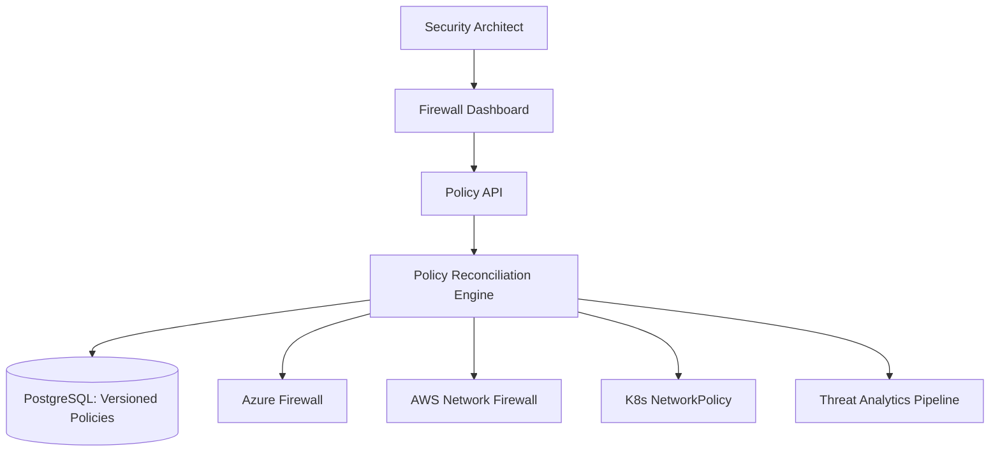

### 2. Detailed Component Topology
The internal service mesh and data boundaries of the security platform.

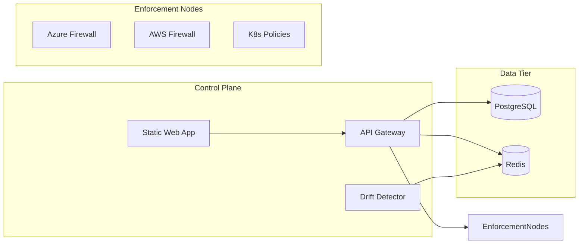

### 3. Frontend to Backend Request Path
Tracing a policy change request from the manager UI.

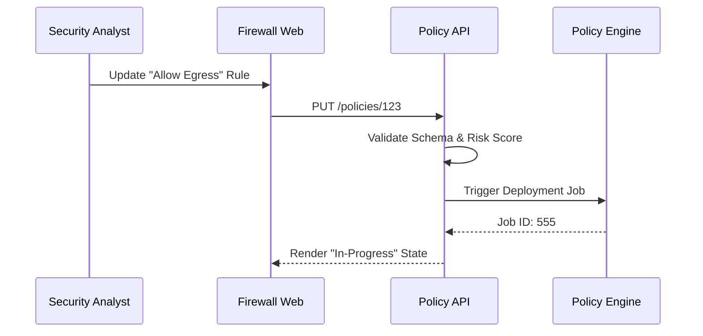

### 4. Multi-Cloud Firewall Control Plane
Managing diverse security providers through a unified abstraction.

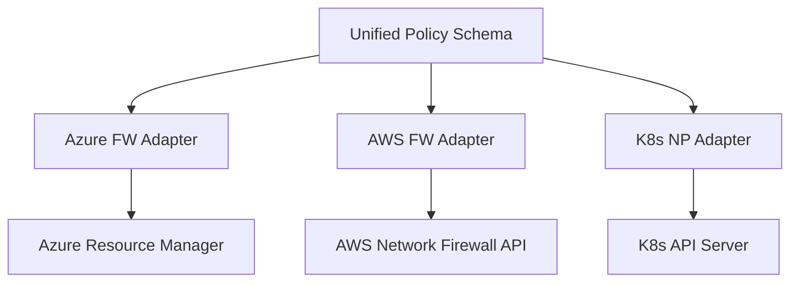

### 5. Distributed Enforcement Topology
Protecting workloads at every layer of the multi-cloud estate.

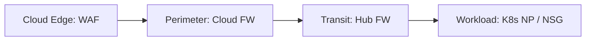

### 6. Regional Deployment Model
Ensuring security low-latency and regional compliance.

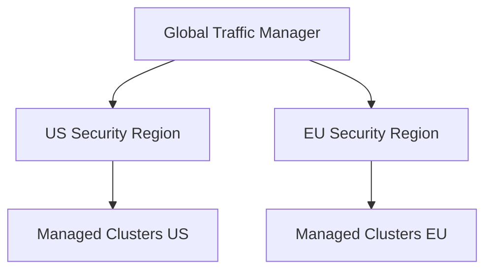

### 7. DR Failover Model
Business continuity for the mission-critical security control plane.

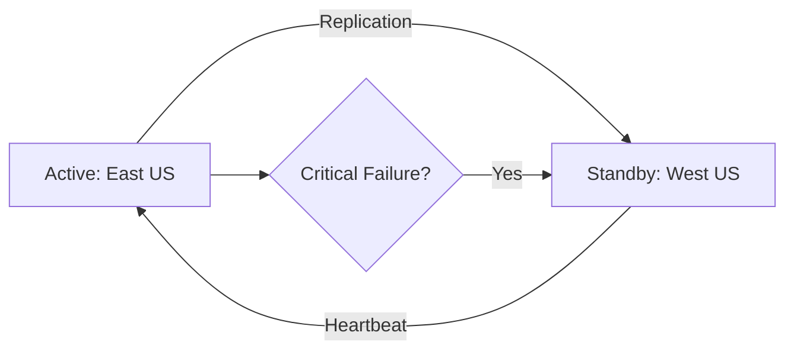

### 8. API Gateway Architecture
Securing and throttling the firewall management interface.

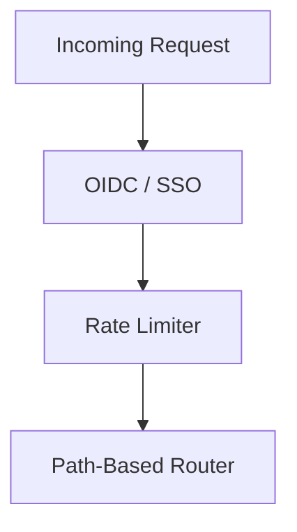

### 9. Queue Worker Architecture
Handling the heavy lifting of global policy synchronization and threat feed ingestion.

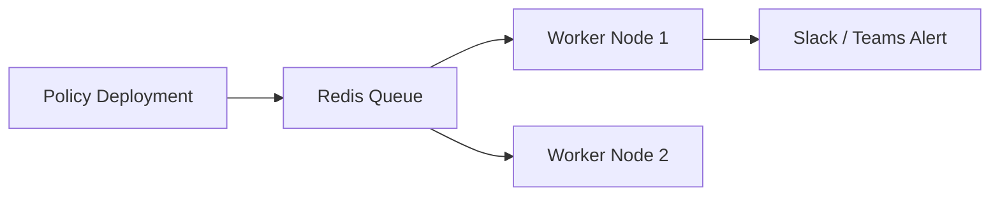

### 10. Dashboard Analytics Flow
How real-time threat and compliance metrics are served to leadership.

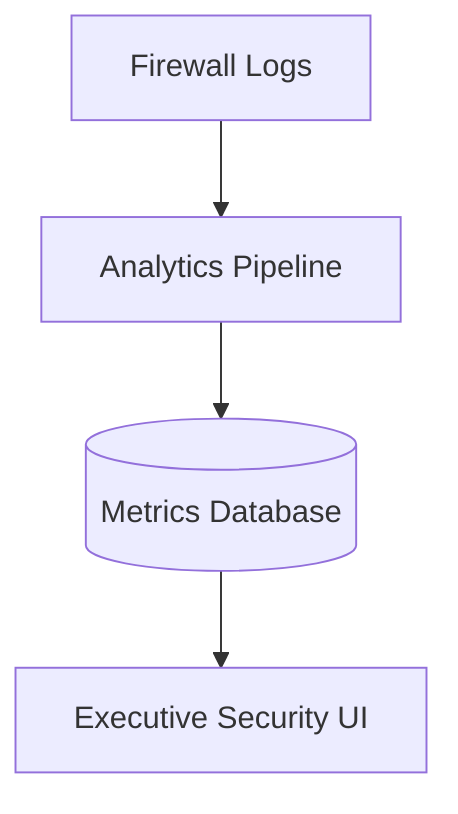

### 11. North-South Traffic Filtering Flow
The perimeter defense for external traffic entering and leaving the cloud.

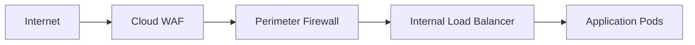

### 12. East-West Microsegmentation Model
Securing pod-to-pod traffic within the same cluster.

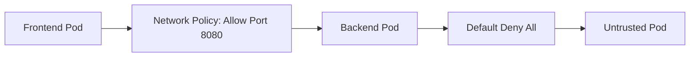

### 13. Kubernetes Network Policy Model
Declarative security for containerized workloads.

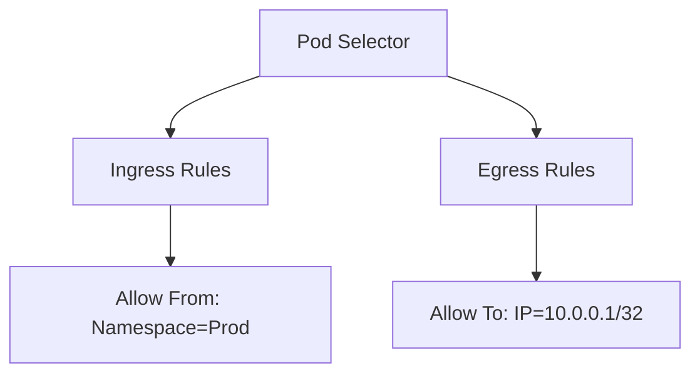

### 14. Service Mesh Security Flow
Identity-based security using mTLS.

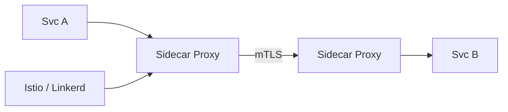

### 15. Private Endpoint Protection Flow
Securing access to PaaS services.

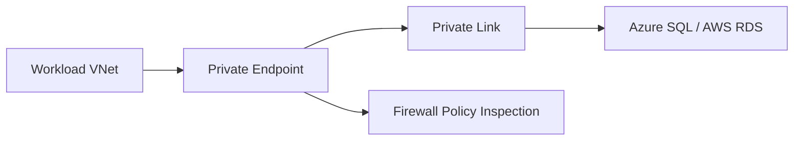

### 16. DNS Security Workflow
Preventing data exfiltration via DNS tunneling.

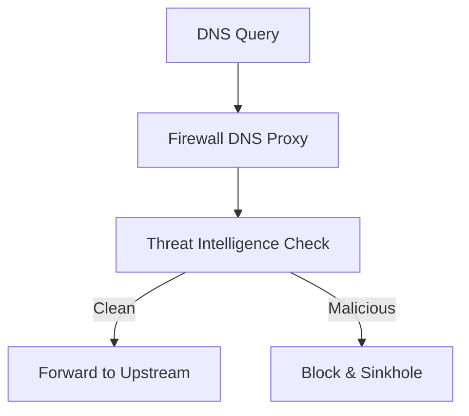

### 17. Egress Control Model
Strictly limiting where applications can send data.

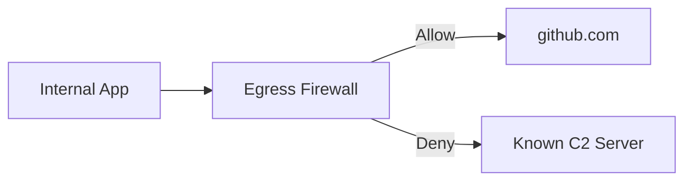

### 18. Hub-Spoke Firewall Topology
Centralizing security for multiple environments.

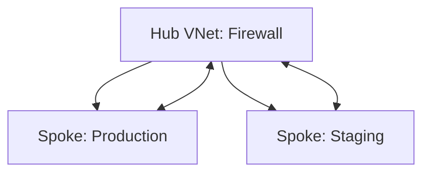

### 19. Transit Gateway Security Model
Securing cross-account traffic in AWS.

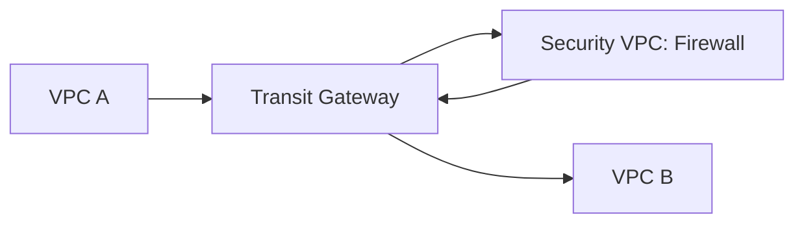

### 20. Multi-Region Security Routing Flow
Consistent security across geographic boundaries.

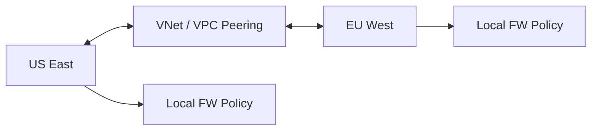

### 21. Policy Authoring Workflow
The collaborative process of rule creation.

```mermaid
graph LR
    Dev[Developer] --> Request[Rule Request]
    Request --> Security[Security Review]
    Security --> Approval[Approval Flow]
    Approval --> Engine[Policy Deployment]
```

### 22. Rule Approval Lifecycle
Multi-stage gates for security changes.

```mermaid
stateDiagram-v2
    [*] --> Draft
    Draft --> PendingReview
    PendingReview --> Approved
    PendingReview --> Rejected
    Approved --> Deployed
    Deployed --> [*]
```

### 23. Change Management Flow
Auditable transitions of security state.

```mermaid
graph TD
    Change[Change ID] --> Audit[Audit Trail]
    Audit --> Diff[Policy Diff]
    Diff --> SignOff[Executive Sign-off]
```

### 24. Drift Detection Workflow
Detecting unauthorized out-of-band changes.

```mermaid
graph LR
    Current[Actual FW State] --> Comparator[Drift Engine]
    Desired[Desired Git State] --> Comparator
    Comparator -->|Mismatch| Alert[Drift Alert]
```

### 25. Automated Remediation Model
Self-healing firewall security.

```mermaid
graph TD
    Drift[Drift Detected] --> Decision{Auto-Remediate?}
    Decision -->|Yes| Reapply[Push Desired Policy]
    Decision -->|No| Ticket[Open ITSM Ticket]
```

### 26. Exception Handling Workflow
Managing temporary or justified risk.

```mermaid
graph LR
    Exception[Request Exception] --> Review[Risk Assessment]
    Review --> Expiry[Set Expiry Date]
    Expiry --> Monitor[Continuous Monitoring]
```

### 27. Compliance Evidence Generation Flow
Automating the "Proof of Security."

```mermaid
graph TD
    Rules[Firewall Rules] --> Mapper[Control Mapper]
    Mapper --> Evidence[PCI/SOC2 Evidence Doc]
    Evidence --> Auditor[External Auditor]
```

### 28. Rule Versioning Lifecycle
Rollback capabilities for network security.

```mermaid
graph LR
    V1[v1.0.0] --> V2[v1.1.0]
    V2 --> Rollback[Revert to v1.0.0]
```

### 29. Tag-Based Policy Model
Dynamic security for dynamic workloads.

```mermaid
graph LR
    Tag[Tag: Environment=Prod] --> Policy[Apply Prod Rules]
    NewInstance[New VM] --> Tag
```

### 30. Least Privilege Network Model
Enforcing the minimum necessary access.

```mermaid
graph TD
    Default[Default Deny] --> Audit[Traffic Audit]
    Audit --> Specific[Specific Allow Rules]
```

### 31. Threat Intel Ingestion Flow
Feeding blocklists into the firewall.

```mermaid
graph LR
    Feed[CrowdStrike / Talos] --> Ingest[Threat Worker]
    Ingest --> Dedupe[Deduplication]
    Dedupe --> Blocklist[Active Blocklist]
```

### 32. IOC Blocklist Update Lifecycle
Continuous protection against known bad actors.

```mermaid
graph TD
    NewIOC[New IP/Domain IOC] --> Validate[Verify IOC]
    Validate --> Deploy[Global FW Push]
```

### 33. Incident Response Workflow
The SOC path for responding to network threats.

```mermaid
graph LR
    Detect[Intrusion Detected] --> Triage[Initial Triage]
    Triage --> Isolate[Network Isolation]
    Isolate --> Recovery[Clean & Restore]
```

### 34. Suspicious Traffic Escalation Flow
From automated detection to human analyst.

```mermaid
graph TD
    Alert[Low Confidence Alert] --> ML[ML Refinement]
    ML -->|High Risk| SOC[Tier 2 Analyst]
```

### 35. SOC Triage Model
Standardized handling of network security events.

```mermaid
graph LR
    Event[Security Event] --> Playbook[Triage Playbook]
    Playbook --> Result[False Positive / True Incident]
```

### 36. DDoS Protection Workflow
Responding to volumetric attacks.

```mermaid
graph TD
    Spike[Traffic Spike] --> Scrubbing[Traffic Scrubbing]
    Scrubbing --> Clean[Clean Traffic to App]
```

### 37. Malware Callback Blocking Flow
Preventing command-and-control communication.

```mermaid
graph LR
    Bot[Infected Pod] --> C2[C2 Request]
    C2 --> FW[Firewall: Blocklist Match]
    FW --> Block[Request Dropped & Logged]
```

### 38. Lateral Movement Detection Model
Detecting the "east-west" attacker.

```mermaid
graph TD
    Pattern[Unusual Peer-to-Peer] --> Score[Anomaly Score]
    Score --> Threshold[Alert Threshold]
```

### 39. Exfiltration Prevention Model
Detecting large unauthorized data transfers.

```mermaid
graph LR
    Data[Large Data Flow] --> Monitor[Bandwidth Monitor]
    Monitor --> Sensitive[Check Destination]
```

### 40. Security Analytics Pipeline
The data engine behind the dashboard.

```mermaid
graph TD
    Logs[Flow Logs] --> Spark[Streaming Analytics]
    Spark --> Store[Aggregated Security Data]
```

### 41. Metrics Pipeline
Monitoring the health of the security control plane.

```mermaid
graph LR
    API[Metrics] --> Prom[Prometheus]
    Prom --> Grafana[Grafana]
```

### 42. Logging Architecture
Auditable logs for every firewall action.

```mermaid
graph TD
    Log[Audit Log] --> Hub[Event Hub / Kinesis]
    Hub --> SIEM[Splunk / Sentinel]
```

### 43. Tracing Model
Observing cross-service security requests.

```mermaid
sequenceDiagram
    Portal->>API: Deploy Rule
    API->>Worker: Sync to Azure
    Worker->>Azure: Apply Policy
```

### 44. SLA Monitoring Flow
Guaranteeing security availability.

```mermaid
graph LR
    Probe[Health Probe] --> Status[SLA Dashboard]
```

### 45. Release Pipeline Workflow
Automated delivery of the security platform.

```mermaid
graph LR
    Git[Code Push] --> CI[Build & Test]
    CI --> CD[Deploy to Sec-VNet]
```

---

## 🔬 Security Operations (SecOps) Runbook

### 1. New Rule Authoring
All new firewall rules MUST follow the "Least Privilege" standard:
- **Scope**: Use CIDR ranges or Service Tags, never `*`.
- **Description**: Must include a valid JIRA/ServiceNow ticket ID.
- **Review**: Must be approved by a peer security analyst.

### 2. Responding to Drift
When the "Drift Detected" alert fires:
1. Verify the change source via CloudTrail / Activity Log.
2. If unauthorized, click **"Remediate"** in the Portal to restore the Git-backed state.
3. Initiate an incident report if the change appears malicious.

---

## 🚦 Getting Started

### 1. Prerequisites
- **Azure CLI / AWS CLI** configured.
- **Terraform** (v1.5+).
- **Docker Desktop**.
- **Python 3.11+**.

### 2. Local Setup
```bash
# Clone the repository
git clone https://github.com/Devopstrio/cloud-native-firewall.git
cd cloud-native-firewall

# Setup environment
cp .env.example .env

# Launch core services
docker-compose up --build
```
Access the management portal at `http://localhost:3000`.

---

## 🛡️ Governance & Security
- **Identity**: Multi-factor authentication required for all policy changes.
- **Encryption**: All policies and secrets are encrypted with customer-managed keys (CMK) at rest.
- **Compliance**: The platform is pre-mapped to **NIST 800-53** and **CIS Benchmarks**.

---
<sub>&copy; 2026 Devopstrio &mdash; Engineering the Future of Network Security.</sub>
