<div align="center">


<h1>Cloud-Native Firewall</h1>

<p><strong>The Institutional-Grade Platform for Standardized Security Foundations, Perimeter Governance, and Multi-Cloud Firewall Ecosystems.</strong></p>

[]()
[]()
[]()

<br/>

> **"Industrializing perimeter security to automate firewall foundations."** 
> **Cloud-Native Firewall** is an enterprise-grade platform designed to provide a secure, measurable, and highly automated foundation for global security operations. It orchestrates the complex lifecycle of network security—from automated policy reconciliation and multi-cloud perimeter enforcement to high-throughput threat intelligence and unified security auditing.

</div>

---

## 🏛️ Executive Summary

Fragmented perimeters and manual firewall rule management are strategic operational liabilities; lack of a standardized cloud-native firewall framework is a primary barrier to organizational engineering maturity. Organizations fail to secure their network boundaries not because of a lack of rules, but because of fragmented enforcement standards, lack of automated policy reconciliation, and an inability to orchestrate security planes with operational precision.

This platform provides the **Security Intelligence Plane**. It implements a complete **Cloud-Native-Firewall-as-Code Framework**, enabling CISOs and Network Security teams to manage global security foundations as first-class citizens. By automating the identification of boundary regressions through real-time telemetry analysis and orchestrating the provisioning of secure performance-driven security policies, we ensure that every organizational network—from core transit hubs to edge microservice pods—is secured by default, audited for history, and strictly aligned with institutional security frameworks.

---

## 📐 Architecture Storytelling: Principal Reference Models

### 1. Principal Architecture: Global Cloud-Native Firewall & Security Intelligence Plane
This diagram illustrates the end-to-end flow from security telemetry ingestion and multi-cloud orchestration to perimeter enforcement, performance validation, and institutional security auditing.

```mermaid
graph LR
    %% Subgraph Definitions
    subgraph SecurityIngress["Boundary & Policy Ingress"]
        direction TB
        Traffic_Signals["North-South Ingress / East-West Flows"]
        Policy_Definitions["IPSec / mTLS / Rule Definitions"]
        Threat_Intelligence["Blocklists / IOCs / Reputation Data"]
    end

    subgraph IntelligenceEngine["Security Intelligence Hub"]
        direction TB
        API["FastAPI Security Gateway"]
        PolicyOrchestrator["Global Policy & Reconciliation Hub"]
        Governance_Hub["Compliance & Guardrail Hub"]
        AIOps_Validator["Drift & Threat Analysis Hub"]
    end

    subgraph OperationsPlane["Distributed Security Ecosystem"]
        direction TB
        ManagedFirewallNodes["Managed Standardized Enforcement Nodes"]
        ActiveRunbooks["Managed Automated Remediation Runbooks"]
        PerimeterSinks["Managed Infrastructure Delivery Hubs"]
    end

    subgraph OperationsHub["Institutional Data Hub"]
        direction TB
        Scorecard["Security Maturity Scorecard"]
        Analytics["Security Flow & Threat Velocity Stats"]
        Audit["Forensic Security Metadata Lake"]
    end

    subgraph DevOps["Cloud-Native-Firewall-as-Code Framework"]
        direction TB
        TF["Terraform Security Modules"]
        DriftBot["Productivity & Config Drift Validator"]
        ChatOps["Measurement Operations Hub"]
    end

    %% Flow Arrows
    SecurityIngress -->|1. Submit Telemetry| API
    API -->|2. Orchestrate Security| PolicyOrchestrator
    PolicyOrchestrator -->|3. Apply Privacy Guard| Governance_Hub
    Governance_Hub -->|4. Assess Drift| AIOps_Validator
    
    AIOps_Validator -->|5. Execute Enforcement| OperationsPlane
    OperationsPlane -->|6. Notify Status| ChatOps
    API -->|7. Visualize Health| Scorecard
    
    Scorecard -->|8. Track Maturity| Analytics
    Scorecard -->|9. Record Performance| Audit
    
    TF -->|10. Provision Backbone| IntelligenceEngine
    DriftBot -->|11. Inject Friction Risk| PolicyOrchestrator
    Audit -->|12. Improve Operations| ManagedFirewallNodes

    %% Styling
    classDef ingress fill:#f5f5f5,stroke:#616161,stroke-width:2px;
    classDef intel fill:#e8eaf6,stroke:#1a237e,stroke-width:2px;
    classDef operations fill:#e1f5fe,stroke:#01579b,stroke-width:2px;
    classDef ops fill:#ede7f6,stroke:#311b92,stroke-width:2px;
    classDef devops fill:#e8f5e9,stroke:#1b5e20,stroke-width:2px;

    class SecurityIngress ingress;
    class IntelligenceEngine intel;
    class OperationsPlane operations;
    class OperationsHub ops;
    class DevOps devops;
```

### 2. The Firewall Lifecycle Flow
The continuous path of a cloud-native firewall platform from initial integration (authorize) and aggregation (authenticate) to active analysis (inspect), optimization (enforce), and institutional forensic auditing (scorecard).

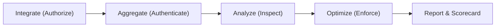

### 3. Distributed Security Topology
Strategically orchestrating standardized security across global regions, diverse cloud architectures, and multi-cloud targets, providing a unified institutional view of global security health and operational readiness.

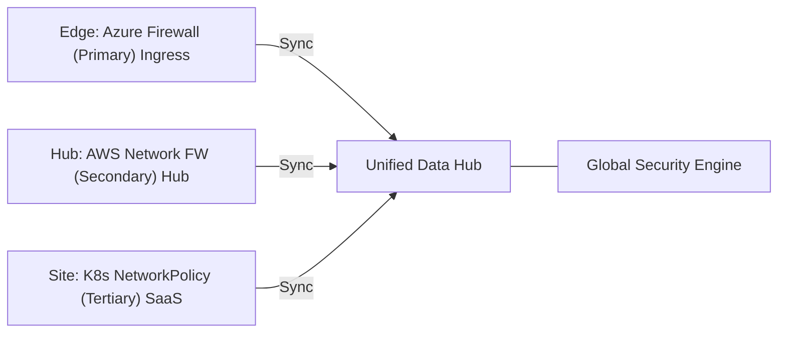

### 4. Security Hub & High-Trust Data Plane Protection Flow
Executing complex logic for securing the bridge between security owners and technical teams, ensuring every organizational identity is verified, finding-level privacy is maintained, and every security access is according to institutional standards.

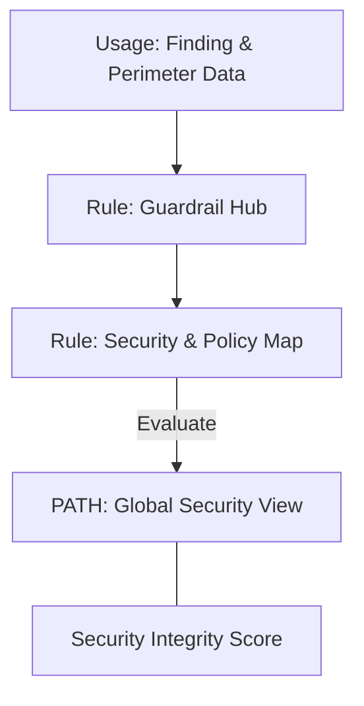

### 5. Multi-Cloud Security Federation & Governance Flow
Automatically managing unified security standards across global regions and diverse cloud tenants, ensuring institutional data residency and privacy boundaries by default.

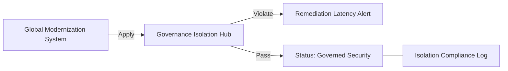

### 6. Encryption & Perimeter Protection Flow (Security Standard)
Managing the lifecycle of a security request, automatically enforcing institutional TLS 1.3 and resource encryption standards as required by security policy, ensuring zero-latency security confidence.

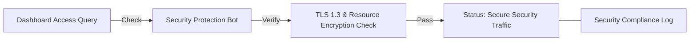

### 7. Institutional Security Maturity Scorecard
Grading organizational performance based on key indicators: Policy Consistency Index, Zero-Trust Adoption Index, and Threat Mitigation Scores.

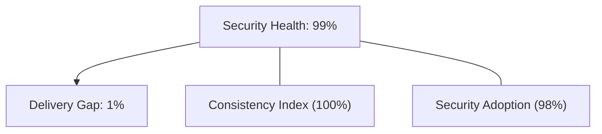

### 8. Identity & RBAC for Security Governance
Managing fine-grained access to security hubs, provisioning workers, and audit logs between CISOs, SOC Leads, and Network Security Engineers.

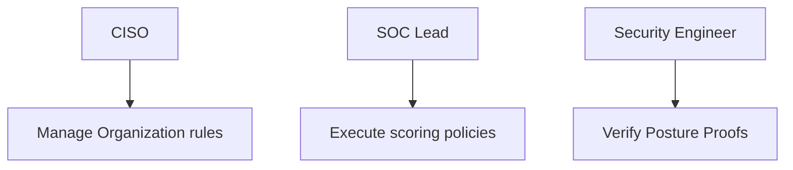

### 9. IaC Deployment: Cloud-Native-Firewall-as-Code Framework
Using modular Terraform to deploy and manage the versioned distribution of the security tracking hubs, enforcement protection workers, and forensic metadata lakes.

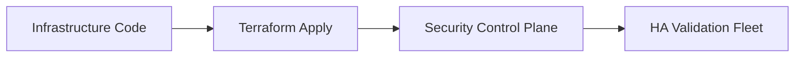

### 10. AIOps Security Drift & Risk Validation Flow
Using advanced analytics to identify sudden surges in security findings, unauthorized rule changes, suspicious configuration drifts, or unusual delivery pattern changes that could result in institutional risk or audit failure.

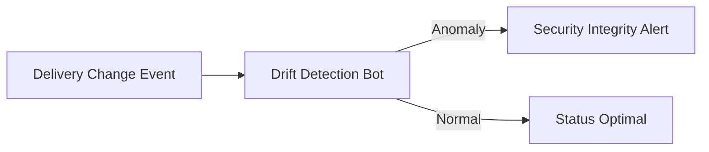

### 11. Metadata Lake for Forensic Security Audit
Storing long-term records of every security integration event (metadata), every rule executed, and every version history for institutional record-keeping, compliance auditing, and post-provisioning forensics.

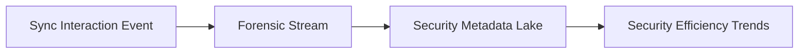

---

## 🏛️ Core Governance Pillars

1.  **Unified Foundation Coordination**: Maximizing resilience by centralizing all security measurement through a single institutional plane.
2.  **Automated Perimeter Provisioning**: Eliminating "manual rule" scenarios through proactive orchestration and pattern verification.
3.  **Sequential Security Intelligence**: Ensuring zero-interruption operations through dependency-aware security-driven data engineering.
4.  **Zero-Trust Identity Protection**: Automatically enforcing identity-based access, data-at-rest encryption, and policy evaluation across all assurance tiers.
5.  **Autonomous Operations Logic**: Guaranteeing reliability through automated industry-specific effectiveness monitoring runbooks.
6.  **Full Security Auditability**: Immutable recording of every rule change and security provision for institutional forensics.

---

## 🛠️ Technical Stack & Implementation

### Security Engine & APIs
*   **Framework**: Python 3.11+ / FastAPI.
*   **Performance Engine**: Custom Python-based logic for multi-cloud rule reconciliation and DORA-style security metrics.
*   **Integrations**: Native connectors for Azure Firewall, AWS Network Firewall, and K8s NetworkPolicies.
*   **Persistence**: PostgreSQL (Security Ledger) and Redis (Live Enforcement State).
*   **Auth Orchestrator**: Federated OIDC/SAML for least-privilege security management access.

### Governance Dashboard (UI)
*   **Framework**: React 18 / Vite.
*   **Theme**: Dark, Slate, Indigo (Modern high-fidelity productivity aesthetic).
*   **Visualization**: D3.js for delivery topologies and Recharts for threat velocity analytics.

### Infrastructure & DevOps
*   **Runtime**: AWS EKS or Azure Kubernetes Service (AKS) for management plane.
*   **Measurement Hub**: Managed event sourcing for immutable productivity timeline reconstruction.
*   **IaC**: Modular Terraform for deploying the security landing zone and validation fleet.

---

## 🏗️ IaC Mapping (Module Structure)

| Module | Purpose | Real Services |
| :--- | :--- | :--- |
| **`infrastructure/security_hub`** | Central management plane | EKS, PostgreSQL, Redis |
| **`infrastructure/enforcers`** | Distributed perimeter provisioners | Azure, AWS, GCP APIs |
| **`infrastructure/policy_pipes`** | Data Ingestion Hubs | Webhooks, Lambda |
| **`infrastructure/auditing`** | Forensic modernization sinks | S3, Athena, Quicksight |

---

## 🚀 Deployment Guide

### Local Principal Environment
```bash
# Clone the Cloud-Native Firewall repository
git clone https://github.com/devopstrio/cloud-native-firewall.git
cd cloud-native-firewall

# Configure environment
cp .env.example .env

# Launch the Security stack
make init

# Trigger a mock security update and automated guardrail validation simulation
make simulate-firewall
```

Access the Management Portal at `http://localhost:3000`.

---

## 📜 License
Distributed under the MIT License. See `LICENSE` for more information.

---
<div align="center">
  <p>© 2026 Devopstrio. All rights reserved.</p>
</div>
